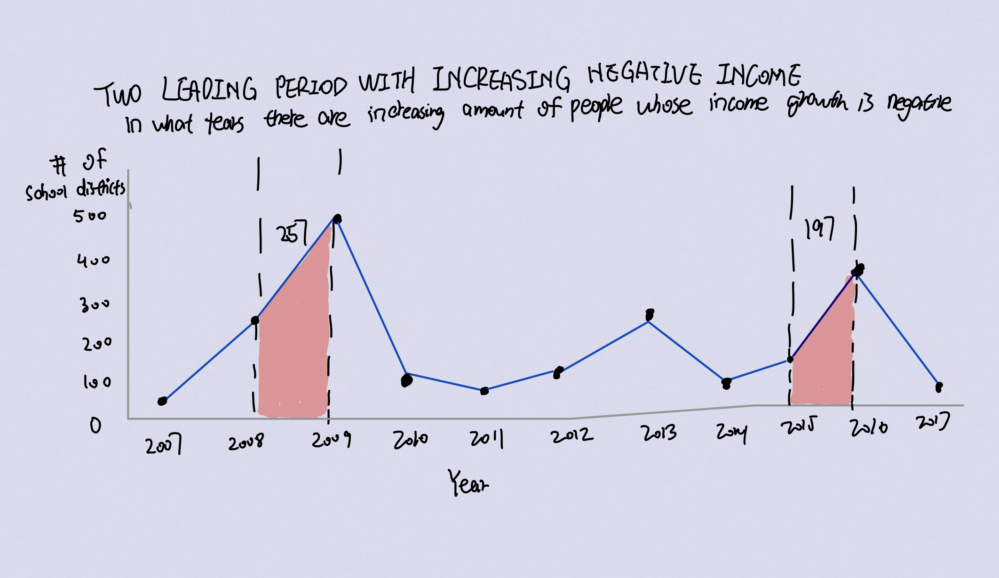

Step 1: 
This is the data visualization that I selected. It aims to display the number of PA school districts with negative income growth rate and identify the surging period of when
it happened.

  

Step 2: 
Critiques:
Based off Stephen Few's Data Visualization Effectiveness Profile, I will critique this visulization from five perspectives:
1. Useless VS Useful: This graphic is very useful as it presents the historical trend of taxable income growth of PA school districts. 
2. Completeness: I think this graphic needs more clarification in explaining the message that it wants to express.
3. Perceptibility: I can not understand this graph with minimal efforts because there isn't a "highlighted" object to catch my attention at the first place, and I have to look
for the message
4. Truthfulness: This graphic presents truthful data as it is. There isn't torted data.
5. Intuitiveness: This graphic isn't as intuitive because it presents negative income growth which means a decrease in income, but we are looking at the increase of the count of negative income growth school districts. So it takes some efforts to understand what it is truly trying to deliver. 
Step 3: 
Below is a visualization of my wireframe 

  

Step 4:
Chenxiao Guan (Test Case 1): 
Q: What message do you think this graph is trying to deliver?
A: I think this graphic is trying to show me the trend of a metric from 2007 to 2017. 
Q: Who do you think might find this graphic useful?
A: I think maybe school district officials or people who are designing the tax rates would find it useful as it will give them an idea of what to expect and also how they performed. 
Q: What do you think is unclear or confusing in this graphic?
a: I think when I first looked at this graphic, the color looks professional and there isn't too many of them just blue and white. But maybe adding just another color to emphasize one of the year can be more intuitive in delivering the message. 
Step 5: 
 
