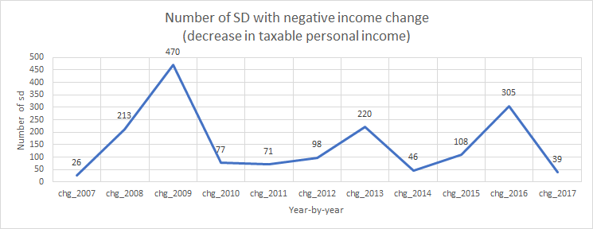
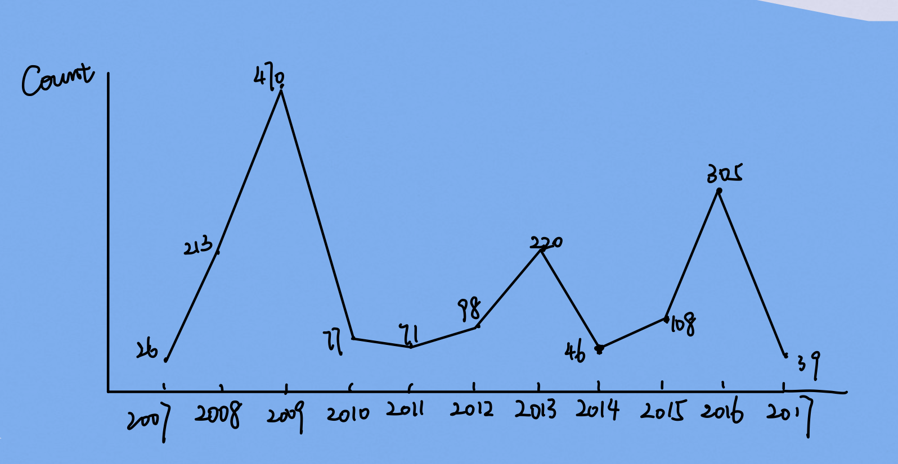
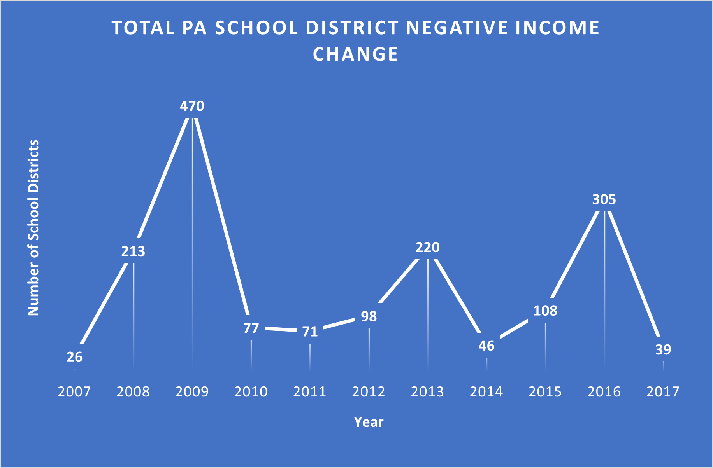

**Step 1:
This is the data visualization that I selected. It aims to display the number of PA school districts with negative income growth rate and identify the surging period of when
it happened.**

  

**Step 2: 
Critiques:** 
**Data:** 
This dataset contains information regarding PA school districts. In this graph, the purpose is to present the trend of number of PA School districts with negative income change, that is their income has decreased. In the original graphic, I discovered several issues as an audience: 1. The title is not as descriptive 2. The x axis variable names do not make sense to the audience. 3. The range of y axis is too crowded. 4. The background grid isn't necessary. 5. The numbers should be located at each year instead of around the slope segment. 
Essentially there are two surging periods with growing number of school districts with negative income change: 2008 to 2009 and 2015 to 2016 as year 2009 and year 2016 represents highest and second highest count respectively. 
Based off Stephen Few's Data Visualization Effectiveness Profile, I will critique this visulization from five perspectives:
1. Useless VS Useful: This graphic is very useful as it presents the historical trend of taxable income growth of PA school districts. 
2. Completeness: I think this graphic needs more clarification in explaining the message that it wants to express.
3. Perceptibility: I can not understand this graph with minimal efforts because there isn't a "highlighted" object to catch my attention at the first place, and I have to look
for the message
4. Truthfulness: This graphic presents truthful data as it is. There isn't torted data.
5. Intuitiveness: This graphic isn't as intuitive because it presents negative income growth which means a decrease in income, but we are looking at the increase of the count of negative income growth school districts. So it takes some efforts to understand what it is truly trying to deliver.  
<a href="./Dataset_critique.xlsx">download</a>  
**Step 3:  
Below is a visualization of my wireframe** 

  

**Thought Processs:** 
There are some small places I would like to change: axies names, position of numbers, title name and overall color theme.  
**Step 4:  
Test Solutions** 
Chenxiao Guan (Test Case 1): 
Q: What message do you think this graph is trying to deliver?
A: I think this graphic is trying to show me the trend of a metric from 2007 to 2017. 
Q: Who do you think might find this graphic useful?
A: I think maybe school district officials or people who are designing the tax rates would find it useful as it will give them an idea of what to expect and also how they performed. 
Q: What do you think is unclear or confusing in this graphic?
a: I think when I first looked at this graphic, the color looks professional and there isn't too many of them just blue and white. But maybe adding just another color to emphasize one of the year can be more intuitive in delivering the message. 
Eagon Wang( Test Case 2):
Q: What message do you think this graph is trying to deliver?
A: some growth rate trend over the past 10 years?
Q: Who do you think might find this graphic useful?
A: I think the numbers give me a better sense of the data and the slope of the segment lines indicates their growth rate as well. Everything is very clear.  
Q: What do you think is unclear or confusing in this graphic?
A: I think maybe providing more context to it, because I would be a bit confused to learn about the increasing count of negative income...Like give a description to describe this graph.  
**What I learned:**
A common message that I am getting is that the information that this graphic is trying to convey is not as clear. I think I will need to add a separate paragraph to better explain this graph. Additionally, I will keep the simple color schemas as they appear to be clear to the audience. 
**Step 5:  
Visulize the solution 
Graph:** 

  

**Insights:** 
1. When the datapoints are not as complicated, add some background color can better contrast the results. 
2. Do not include varibale names that audience do not know in axies 
3. Add numbers to appropriate positions rather than ambigous positions.  
**Summary:** 
In my final solution, I fixed all the issues I mentioned in step 2: axis names, title, background color, number position. Besides, I added a bit vertical lines to help 
the audience better understand the data. However, I think adding a separate paragraph to explain this graph is necessary as the grahic itself may not convey as much information
as it intends to do.
What I wish to do more: I wish to highlight the segment of two surging periods if possible: segments from 2008 to 2009 and 2015 to 2016, because I would like my audience to focus on these two periods as they reflect the worst financial situations during these ten years. Also add a short paragraph to explain why we are exploring this dataset. 
**Paragraph:** 
This graphic presents the number of PA school districts with a negative income change. A higher number indicates more school districts are expericing income decrease compare to previous years. In other words, a higher point indicates a worse financial situation. 
[Go Back](/README.md)
