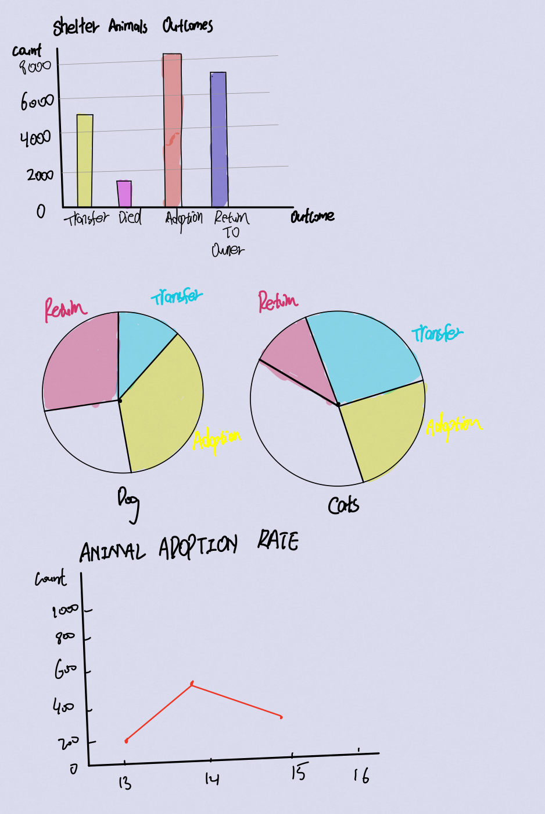
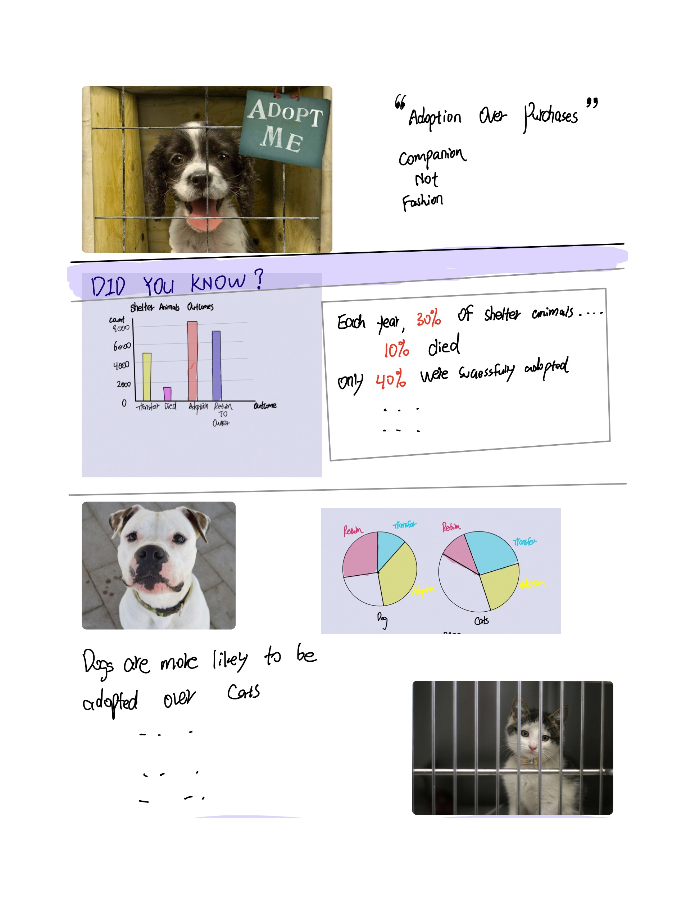
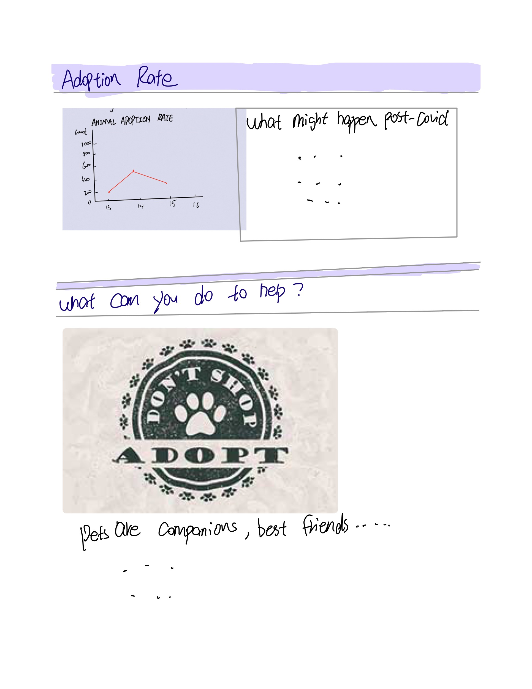

As the final part of the project, I will record all the changes made to the prior version and summarize this project after receiving some comments and advices from my classmates
and professors.  
**Progess:** 
**How did I receive comments/advices**: From group critiques, my teammates suggested me that I should enrich my stories and make the storyline clear throughout the entire story. Because my primary purpose is to acknowledge people about the current status of shelter animals and encourage those to adopt over purchase pets, I need to list evidence of shelter animals
needing our attentions in the forms of real stories. Additionally, I met with professor to discuss possible improvements on my project. Professor suggested to me that I should ask 
myself why I decided to do this topic and what do I want to achieve. I then realized what might be missing for me to tell a meaningful story. 
**What did I change:**  
I reached out to my friend who was the president of one animal rescue team in Beijing for getting more statistics and orginal photos as my sources. I adjusted
the order my story. The outline now is updated as following: 
1. Introduction page ( **Photo hanged to original photo of a stray cat taken by the rescue team** )
2. Starting story of why I want to do this topic: A photo of my own pet, purchased from a breeder. I will explain that I thought about adopting another pet from the shelter in PA 
since COVID. However I wish to make the point that I purchased a pet.  ( **Newly Added**)
3. Introductary statistical page of overall shelter animals in the US : data presented by APSCA  
4. Statistics exploring the outcomes of the shelter animals:  
5. Story of a senior dog being abandoned and readopted: real story from ASCPA  
6. Introduce the point that people are more likely to adopt kittens and puppies.  
7. US Pets Abandonment rates by regions. ( **Newly Added**) 
8. Story of xiaohua, an twice abandoned dog who were poorly treated by his owner after him purchaisng a good greed dog.( **Newly Added**)   
9. Checklist for people prior to adoptions.( **Newly Added**)  
10. Referencs ( **Newly Added**)  
**Updated Outlines:**  
Introductary Story --- Shanzhu Story --- US Shelter Animal Statistics Visulization --- Buddy Story as a senior dog --- Adoption Rates VS Age Visulization --- US pets abandonment 
visulization --- Xiaohua Story --- Checklist --- References   
**Audience:**   The intended audience are two groups of people. 1. Those who are thinking about purchasing a pet from a breeder. I want to target this group because prior to I purchased a pet, I was not fully aware of the conditions of shelter animals. If I had known that a large percentage of shelter animals don't have the chance to be adopted, I would of changed my decision of purchasing a pet from breeders. The more people purchase from breeders, the less likely shelter animals would be adopted. I wish to give them a comprehensive picture for them to make a well-rounded decision。 2. Those who wanted to adopt shelter animals because of COVID. I want to target this group because from the stories my friend told me about those abandoned pets and how adopted animals were sent back to the shelters again, I think people need to be aware of the responsibilities of adopting a shelter animal. It is possible that the animals have post-adandondment effects such as anxieties. And People need to be aware that once they have made the decision of adopting this animal, they need to be responsbile for him or her for about 10 years ( varies based on the age ) and may lose some "freedom" since pets can not travel for a long time. 
**Personas:**  
**Shelly:** adopted two cats from PA shelter and because these two cats used to live together, she made the decision to adopt them both and rented an extra room for them. 
**Sara:** Sara visited the shelter and decided to adopt Banji who has slight anxiety. She was abandoned because she gets very anxious when goes into a car, her owner decided to abandon her when he had to move to another city by driving. Sara took her home and after had her for a week she realized that banji's anxiety is more sever than she thought. As long as Banji met some new friends(dogs or cats), she would poop and pee in the house. Sara lives by herself and has to work remotely for the day. She realized that she couldn't handle Banji's constant irregular reactions to new things. She called the shelters and returned Banji. Sara adopted Banji thinking that she was more than ready for taking care of Banji, however she didn't realize that Banji's anxiety is this severe. Sara commented that she decided not to have a pet untill she is married where her partners and she can better take care of the pet.  
**Call To Actions:** I also changd my call to actions. I placed a checklist at the end for those who wanted to adopt or purchase. They can use this checklist to examine themselves to see whether they are ready to adopt a shelter animal or check whether they should purchase over adopt. Additionally, I will post some resouces for people who are interested to explore because the more people know about what's happening for shelter animals, the less shelter animals there might be.  
**References:**  
All sources used in Shorthand Story are included below: 
**Part I**  
**Project Outline:** Introductary Story --- Shanzhu Story --- US Shelter Animal Statistics Visulization --- Buddy Story as a senior dog --- Adoption Rates VS Age Visulization --- US pets abandonment 
visulization --- Xiaohua Story --- Checklist --- References   
**High Level Summary:** For my final project, I’d like to use shorthand to deliver a website to present the results of animals left the shelters to encourage people to adopt animals instead of buying animals.
I chose this topic because as a pet owner myself, I have gotten to know some shelter animals’ living conditions as well as shelter animals. I wish to use this website to acknowledge people who wish to own a pet about the current situation that shelter animals are facing. Some major elements my project will include are:
Shelter Animals Outcomes after adoptions
Important Factors to A Successful Adoption
Emphasis of “Compassion over Fashion” and “Adopting over Purchasing” Visulizations. The story arc is to gradually introduce the audience the current situation that shelter animals are facing and what they might expect in midst of global pandemic.
The final Call to Action is to spread the awareness of adopting over purchasing as well as compassion over fashion to encourage people who wish to adopt animals to consider the option of adopting over purchasing and while choosing an animal to adopt, Not consider it’s looking first because the purpose of a pet is companion. 
**Link to Data**: <a href="./train.csv">download</a>  
**Method and Medium**: I will use shorthand to create a story including some graphcis as well as some photos from news. I envision this shorthand website will include three sections.  
Section 1: A title page showing pictures of some shelter animals with a big heading "Compassion Over Passion" --- A subtitle page gives some statistics about shelter animals such as the growth of the count of shelter animals.  
Section 3: Graphics presenting their outcomes, factors affecting the outcomes. For instance: 40% of the shelter animals ended up being transferred to another owner or shelter. Age contributes significantly to the final outcome of the animal. Dogs have a higher chance to be adopted over cats. 
After introducing these statistics and visulizations to the audience, I wish to include some current policies protecting and helping shelter animals and places where shelter animals still need help on.  
Lastly, I will include a few ways where people can seek more related resources from, ways to help initiating more policies to help shelter animals or just to spread the awareness of "Aopting over Purchasing".  
**Part II**  
**Sketches:**  

  

  

  

**Note**: More added in the final version. 

  

  

  

 

  

 

  

    

  

