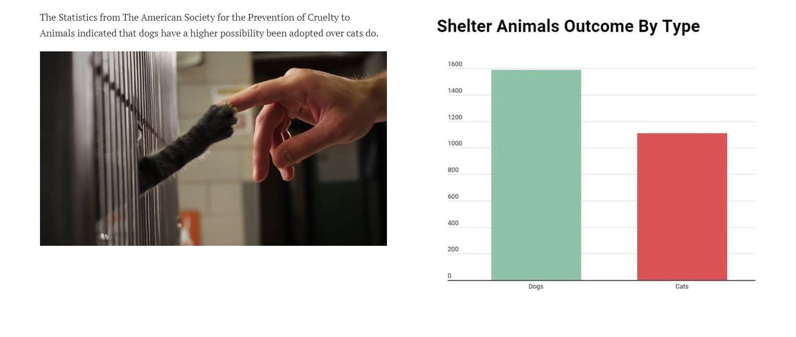
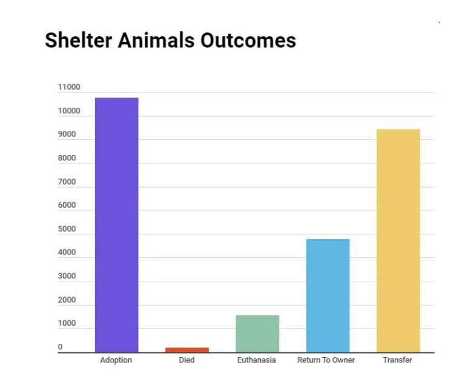
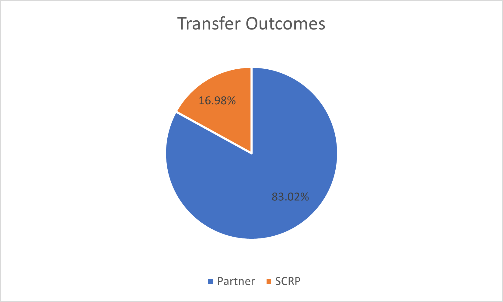
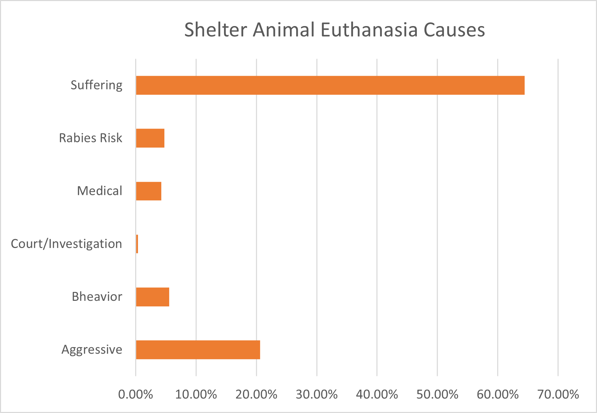
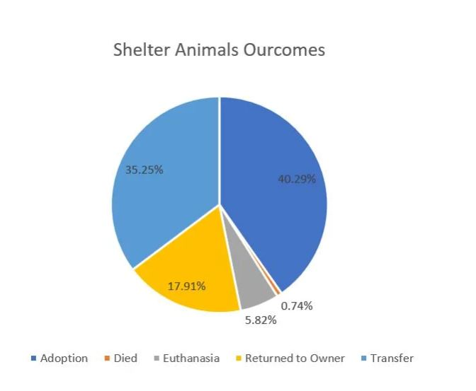
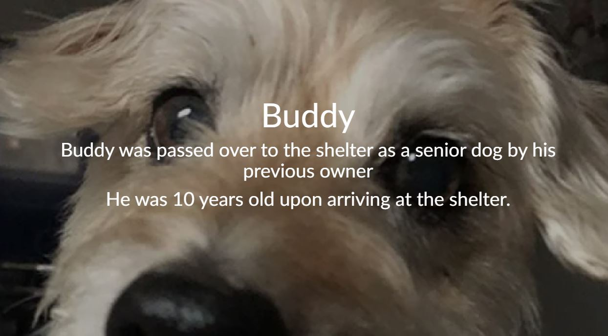
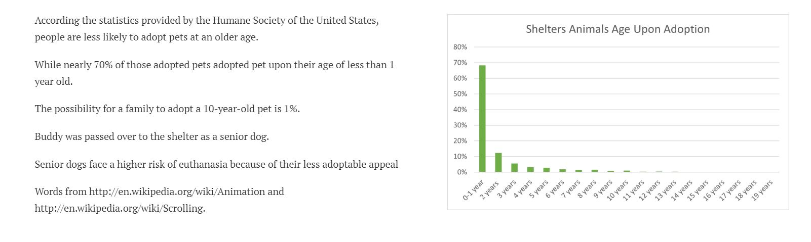
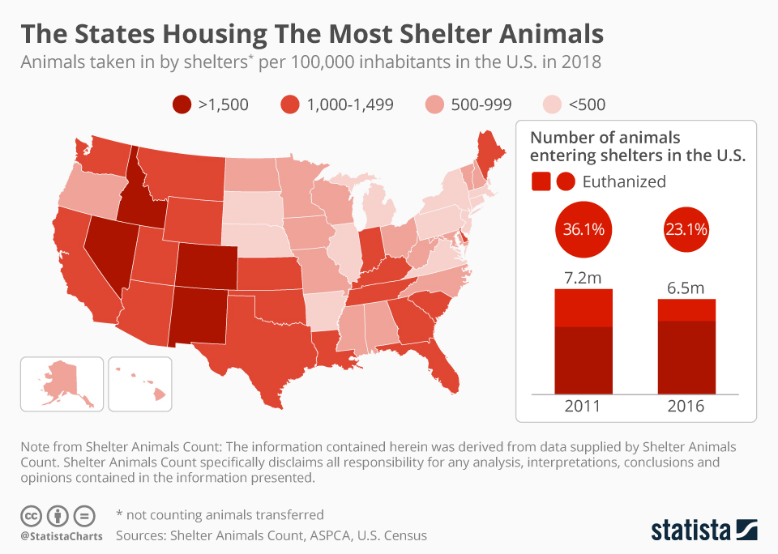

As the final part of the project, I will record all the changes made to the prior version and summarize this project after receiving some comments and advices from my classmates
and professors.  
**Progess:** 
**How did I receive comments/advices**: From group critiques, my teammates suggested me that I should enrich my stories and make the storyline clear throughout the entire story. Because my primary purpose is to acknowledge people about the current status of shelter animals and encourage those to adopt over purchase pets, I need to list evidence of shelter animals needing our attentions in the forms of real stories. Additionally, I met with professor to discuss possible improvements on my project. Professor suggested to me that I should ask myself why I decided to do this topic and what do I want to achieve. I then realized what might be missing for me to tell a meaningful story. 
**What did I change:**  
I reached out to my friend who was the president of one animal rescue team in Beijing for getting more statistics and orginal photos as my sources. I adjusted
the order my story. The outline now is updated as following: 
1. Introduction page ( **Photo hanged to original photo of a stray cat taken by the rescue team** )
2. Starting story of why I want to do this topic: A photo of my own pet, purchased from a breeder. I will explain that I thought about adopting another pet from the shelter in PA since COVID. However I wish to make the point that I purchased a pet.  ( **Newly Added**)
3. Introductary statistical page of overall shelter animals in the US : data presented by APSCA  
4. Statistics exploring the outcomes of the shelter animals:  
5. Story of a senior dog being abandoned and readopted: real story from ASCPA  
6. Introduce the point that people are more likely to adopt kittens and puppies.  
7. US Pets Abandonment rates by regions. ( **Newly Added**) 
8. Story of xiaohua, an twice abandoned dog who were poorly treated by his owner after him purchaisng a good greed dog.( **Newly Added**)   
9. Checklist for people prior to adoptions.( **Newly Added**)  
10. Referencs ( **Newly Added**)  
**Updated Outlines:**  
Introductary Story --- Shanzhu Story --- US Shelter Animal Statistics Visulization --- Buddy Story as a senior dog --- Adoption Rates VS Age Visulization --- US pets abandonment 
visulization --- Xiaohua Story --- Checklist --- References   
**Audience:**   The intended audience are two groups of people. 1. Those who are thinking about purchasing a pet from a breeder. I want to target this group because prior to I purchased a pet, I was not fully aware of the conditions of shelter animals. If I had known that a large percentage of shelter animals don't have the chance to be adopted, I would of changed my decision of purchasing a pet from breeders. The more people purchase from breeders, the less likely shelter animals would be adopted. I wish to give them a comprehensive picture for them to make a well-rounded decision。 2. Those who wanted to adopt shelter animals because of COVID. I want to target this group because from the stories my friend told me about those abandoned pets and how adopted animals were sent back to the shelters again, I think people need to be aware of the responsibilities of adopting a shelter animal. It is possible that the animals have post-adandondment effects such as anxieties. And People need to be aware that once they have made the decision of adopting this animal, they need to be responsbile for him or her for about 10 years ( varies based on the age ) and may lose some "freedom" since pets can not travel for a long time. 
**Personas:**  
**Shelly:** Shelly adopted two cats from PA shelter and because these two cats used to live together, she made the decision to adopt them both and rented an extra room for them. 
**Sara:** Sara visited the shelter and decided to adopt Banji who has slight anxiety. She was abandoned because she gets very anxious when goes into a car, her owner decided to abandon her when he had to move to another city by driving. Sara took her home and after had her for a week she realized that banji's anxiety is more sever than she thought. As long as Banji met some new friends(dogs or cats), she would poop and pee in the house. Sara lives by herself and has to work remotely for the day. She realized that she couldn't handle Banji's constant irregular reactions to new things. She called the shelters and returned Banji. Sara adopted Banji thinking that she was more than ready for taking care of Banji, however she didn't realize that Banji's anxiety is this severe. Sara commented that she decided not to have a pet untill she is married where her partners and she can better take care of the pet.  
**Call To Actions:** I also changd my call to actions. I placed a checklist at the end for those who wanted to adopt or purchase. They can use this checklist to examine themselves to see whether they are ready to adopt a shelter animal or check whether they should purchase over adopt. Additionally, I will post some resouces for people who are interested to explore because the more people know about what's happening for shelter animals, the less shelter animals there might be.  
**Part I**  
**Project Outline:** Introductary Story --- Shanzhu Story --- US Shelter Animal Statistics Visulization --- Buddy Story as a senior dog --- Adoption Rates VS Age Visulization --- US pets abandonment 
visulization --- Xiaohua Story --- Checklist --- References   
**High Level Summary:** For my final project, I’d like to use shorthand to deliver a website to present the results of animals left the shelters to encourage people to adopt animals instead of buying animals.
I chose this topic because as a pet owner myself, I have gotten to know some shelter animals’ living conditions as well as shelter animals. I wish to use this website to acknowledge people who wish to own a pet about the current situation that shelter animals are facing. Some major elements my project will include are:
Shelter Animals Outcomes after adoptions
Important Factors to A Successful Adoption
Emphasis of “Compassion over Fashion” and “Adopting over Purchasing” Visulizations. The story arc is to gradually introduce the audience the current situation that shelter animals are facing and what they might expect in midst of global pandemic.
The final Call to Action is to spread the awareness of adopting over purchasing as well as compassion over fashion to encourage people who wish to adopt animals to consider the option of adopting over purchasing and while choosing an animal to adopt, Not consider it’s looking first because the purpose of a pet is companion. 
**Link to Data**: <a href="./train.csv">download</a>  
**Method and Medium**: I will use shorthand to create a story including some graphcis as well as some photos from news. I envision this shorthand website will include three sections.  
Section 1: A title page showing pictures of some shelter animals with a big heading "Compassion Over Passion" --- A subtitle page gives some statistics about shelter animals such as the growth of the count of shelter animals.  
Section 3: Graphics presenting their outcomes, factors affecting the outcomes. For instance: 40% of the shelter animals ended up being transferred to another owner or shelter. Age contributes significantly to the final outcome of the animal. Dogs have a higher chance to be adopted over cats. 
After introducing these statistics and visulizations to the audience, I wish to include some current policies protecting and helping shelter animals and places where shelter animals still need help on.  
Lastly, I will include a few ways where people can seek more related resources from, ways to help initiating more policies to help shelter animals or just to spread the awareness of "Aopting over Purchasing".  
**Part II**  
**Sketches:**  

  

  

  

**Note**: More added in the final version. 

  

  

  

 

  

 

  

    

  

  

**User Researches and Findings:**  
1. Identify interview goals and type of people to interview. 
2. Approach for finding the right candidate.  
3. Interview Script and material.  
4. Findings.  
5. Changes made or to be made for final version.  
I added two pet stories and the shelter animals during COVID-19 section to the draft website.
**Target Group:** I will focus on two groups of people. Firstly, I wish to interview those who has or had a pet. I will ask them the way they got the pet and ask them why they choose to purchase/adopt. Secondly, I wish to interview those who have no previous experiences of raising a pet.  
**Approach for finding the right group:** I will conduct a series of screening questions to send out to my social media and select candidates from received responses. 
**Interview Script:** 1. Have you had or currently raising a pet? If so, did you adopt it or purchase it from a breeder and why? 2. What are your perceptions adopting animals from shelters versus purchasing from the breeders? 3. What do you think the shelter animals' outcomes are? For instance what percentage do you anticipate that will get adopted versus not adopted? Above are some questions that I will ask before showing them the draft website. Here are the followup questions after showing them the website: 1. What did you learn from the website that suprised you or are different from you expectations? 2. If you were to get a new pet, do you still want to adopt/purchase it? ( different based on people's previous answers ) 3. What suggestions do you have for me? For instance, are there some data that you would like to see but it not on here currently?  
**Findings**: I interviewed two people. A used to have a pet which he found on streets and rescued but currently does not have a pet. B adopted a dog with strong anxiety for 1 week and returned the dog back to the shelter. She prepared a lot prior to the dog's arrival, however the dog was expericing much more anxiety than she expected. One time the dog saw other two dogs and started pooping all around the house and similar instance happenened for several more times. As she was living alone and had to work from home, she did not think that she has enough energy for rasing this dog anymore so she decided to send the dog back to the shelter. I interviewed both of them. I found that they are both very suprised at the numbers of shelter animals being actually adopted: They were expecting a much higher rate of adoption. Secondly A suggested that I should include more stories of shelter animals to get the audience more engaged. He understood the statistics and the graphs but as a person who used to rescue pets, he finds real shelter animals story capable of expressing more emotions and engage the audience. B commented on a few wordings and suggested some quotes from those who adopted shelter animals. B also commented she was also interested to see more data visualizations about breeds of the animals at the shelters as this is one of the characteristics that she wanted to see as she was seeking a shelter animal. She actually adopted a breed that was one of those popular dog breeds because she wanted to gave those with some disabilities or those unpopular dogs more chanced to have a home. Thus she suggested me to include more of these detailed information to inform people and provide them with more information that can help them to choose a shelter animal. Particularly when I introduce the point that people tend to adopt puppies or kittens over senior dogs and cats, it's more comprehensive to include other factors that affect people's choice of adopting. Also at the end, it's more intuitive to emphasize the call to action with more comprehensive information of the factors.  
**Changes to be made**: After the interviews, I will include more shelter animals adoption policies at the end of the website and some links for more materials for those who want to know about about adoptions. Additonally, I will add one more real pet story. Lastly, I will add a data visulization on the color and the breed of shelter animals, which ones are least adopted and most adopted. How people can help after hearing about these information.  
**Summary:** I now have a structure so the next step is to add more details to the website, implement those suggestions and explore the dataset a little bit more to see if I can add another informative section.  
**Final Data Story:**  
As for my final version, I intend to start with my own story to explain why I chose this topic. I will firslty give an overview about the current situation of shelter animals in the US: What are the outcomes they are facing? Statistics of those who were successfully and unsuccessfully adopted. Then I wish to use 4 different sources/stories to bring up two specific point 1. Senior pets are less likely to be adopted and they need people's attention. 2. People have a much higher tendency to abandon pets than we think. To support these two points, I will use Buddy's story, European's story, Xiaohua's story and the statistics from ASPCA. Moreover, I will give two real examples happened around me. Shelly and Sara's decisions to adopt pets in midst of pandemic and how those turned out. Laslty, I will spend some time on the overall purpose of this presentation and provide the audience with some resources and checklists where they can actually use if they were to make a decision or want to be more informed 
**Intended Audience for Final Data Story:**  I have made my intended audience more specific. I wish to target people who are currently thinking about adopting a shelter animal and those who prioritize purchases over adoptions. I target these two groups because they will benefit a lot from this presentation and at the same time I wish to show them these information before they make their final decisions because I think adoption should be always priorized before purchases and even for those who decided to adopt, they need to understand the responsibilities of adopting shelter animals.   
**Decisions:**   Some decisions I have made between the second version and the final versions are:   
1. I used my personal story at the beginning to introduce the presentation and other real stories to connect the storyline.   
2. I added a data visualization to show the US pets abandonment rate for different regions  
3. Story of Xiaohua to show the possible traumas to secondly abandoned pet and how important responsibilities are.  
4. Checklists prior to make the decision of adoption  
**Link to Shorthand:**   https://carnegiemellon.shorthandstories.com/accompany-me-adopt-me-/index.html  
**References:**  
All sources used in Shorthand Story are included below: 
https://www.aspca.org/animal-homelessness/shelter-intake-and-surrender/pet-statistics
https://www.animalhumanesociety.org/news/our-favorite-dog-adoption-stories
https://www.statista.com/chart/17980/states-with-most-shelter-pets-in-the-us/
https://www.npr.org/2012/07/11/156609037/in-france-the-abandoned-dog-days-of-summer#:~:text=In%20France%2C%20The%20(Abandoned)%20Dog%20Days%20Of%20Summer%20Every,the%20practice%20is%20under%20way.
https://mp.weixin.qq.com/s/GEzvM8Qal-3wyH7IovcgoQ
https://www.wired.com/story/coronavirus-pet-adoption-boom/
[Go Back](/README.md)
