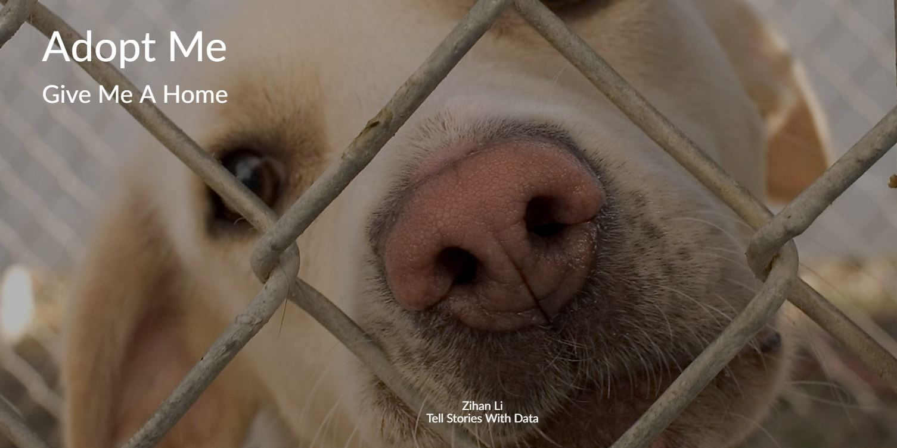
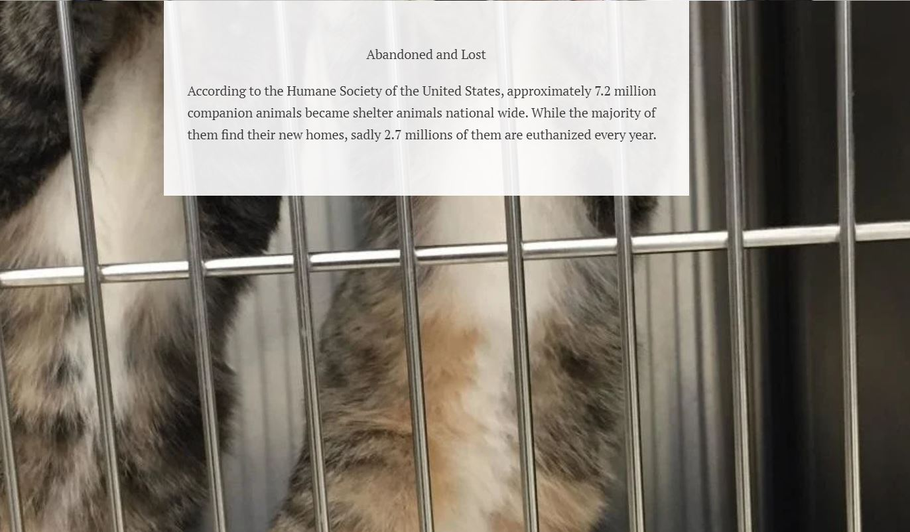
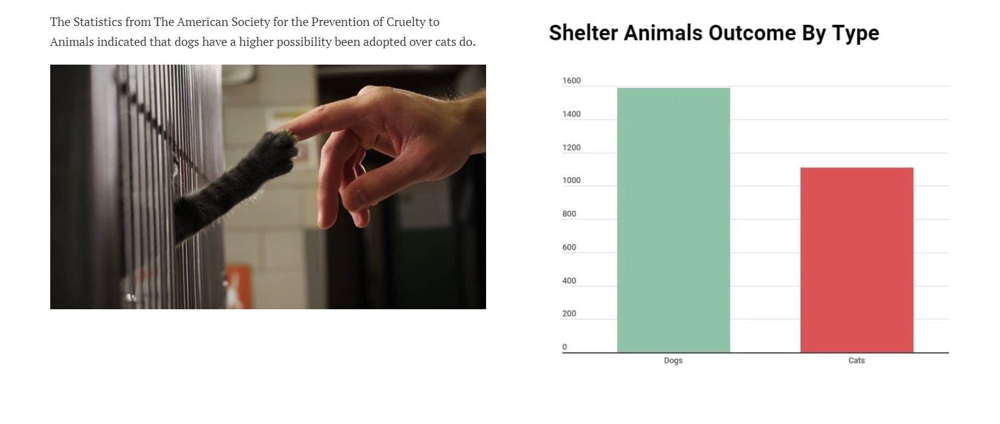
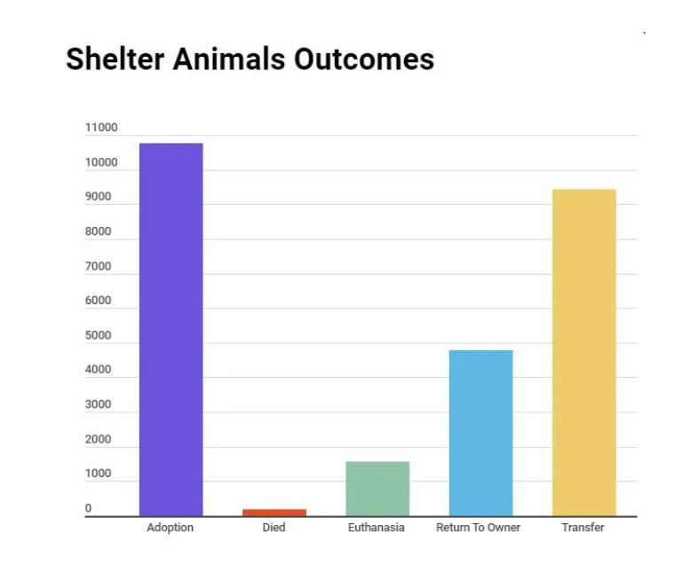
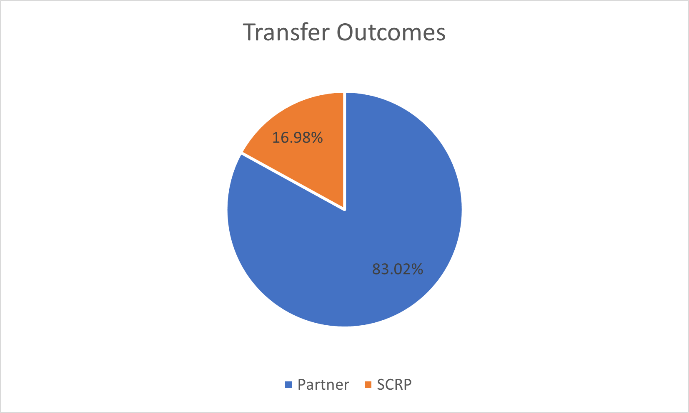
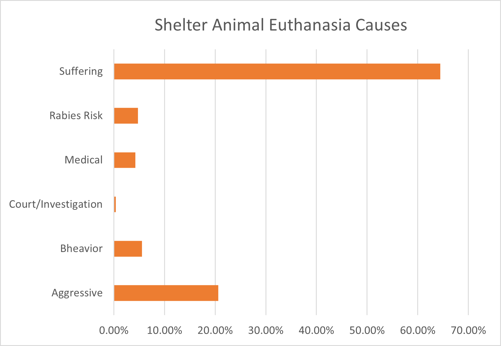
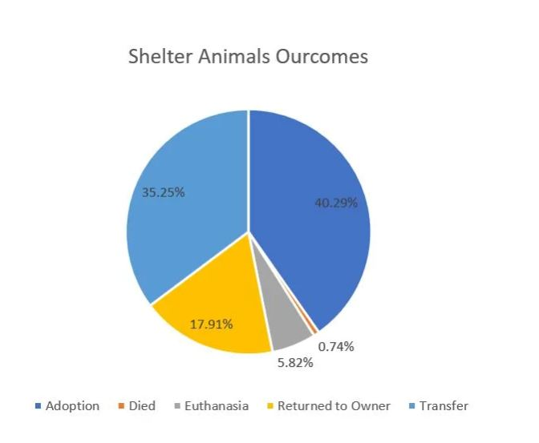
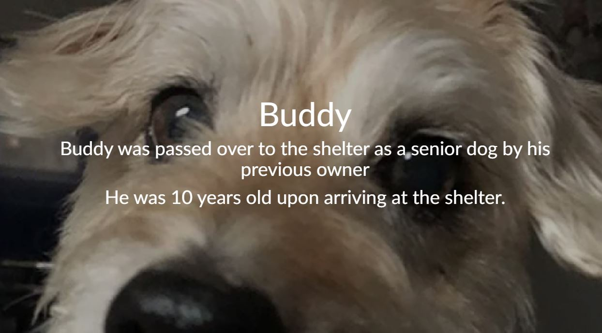
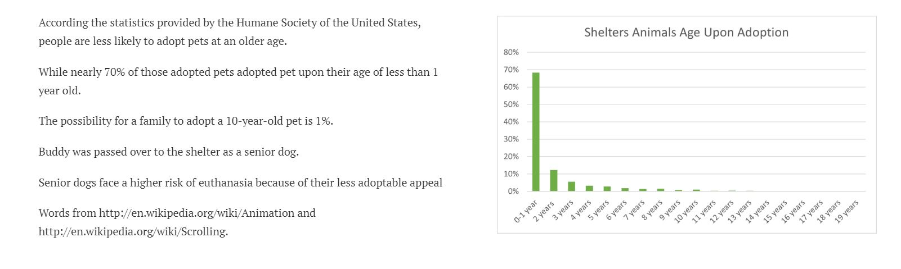

**Wireframes and Storyboards:** 
I created a draft wireframe with Shorthand which contains the major components of my project.  
[Link to Shorthand Preview](https://preview.shorthand.com/SlbyuWutU1nOBh4N) 
**1. Visuals of shelter animals to introduce my topic ( 2 photos )** 

  

 

  

2. Overview of the shelter animals outcomes: 
a. Dogs VS Cats 

  

I intend to show the audience there is a higher possibility for dogs to be adopted over cats. I will provide some analysis next to the visuals on the final version of the website.
b. Adoption Outcomes 

  

This visuals present five outcomes and I will provide brief explanations next to this visuals with what each means. **
**c. Suboutcomes of transfer and enthuasia. 

  

 
This visuals presents the transfer suboutcomes. I wich to give the audience a sense of the distribution of this outcome.  

  

 

  

d. Pet story 

    

This pet story aims to bring up pet's age upon adoption. There is a less possibility for senior dogs to be adopted while they have a higher possibility to be passed over
to the shelters.
e. Shelter animal age upon adoption. 

  

This visuals presents the statistics of pet's age upon adoption 
**f. Pet story**  
In this section, I will elaborate on one of the reasons people abandon their pets to shelters by introducing the frenchs abandoning their pets during theit vacations. 
**g. Shelters Animals during the pandemic time**  
How would the pandemic impact shelter animals and the adoption rates? I would present some recent data regarding the impact and predictions about what might happen post-covid. However not a lot of the data have been released publically and I will still be looking for related data before the final version 

**User Research** 
I will use shorthand to create a draft and use it to conduct my user researches.  
**User Research Protocol:**  
1. Identify interview goals and type of people to interview. 
2. Approach for finding the right candidate.  
3. Interview Script and material.  
4. Findings.  
5. Changes made or to be made for final version.  
I added two pet stories and the shelter animals during COVID-19 section to the draft website.
**Target Group:** I will focus on two groups of people. Firstly, I wish to interview those who has or had a pet. I will ask them the way they got the pet and ask them why they choose to purchase/adopt. Secondly, I wish to interview those who have no previous experiences of raising a pet.  
**Approach for finding the right group:** I will conduct a series of screening questions to send out to my social media and select candidates from received responses. 
**Interview Script:** 1. Have you had or currently raising a pet? If so, did you adopt it or purchase it from a breeder and why? 2. What are your perceptions adopting animals from shelters versus purchasing from the breeders? 3. What do you think the shelter animals' outcomes are? For instance what percentage do you anticipate that will get adopted versus not adopted? Above are some questions that I will ask before showing them the draft website. Here are the followup questions after showing them the website: 1. What did you learn from the website that suprised you or are different from you expectations? 2. If you were to get a new pet, do you still want to adopt/purchase it? ( different based on people's previous answers ) 3. What suggestions do you have for me? For instance, are there some data that you would like to see but it not on here currently?  
**Findings**: I interviewed two people. A used to have a pet which he found on streets and rescued but currently does not have a pet. B adopted a dog with strong anxiety for 1 week and returned the dog back to the shelter. She prepared a lot prior to the dog's arrival, however the dog was expericing much more anxiety than she expected. One time the dog saw other two dogs and started pooping all around the house and similar instance happenened for several more times. As she was living alone and had to work from home, she did not think that she has enough energy for rasing this dog anymore so she decided to send the dog back to the shelter. I interviewed both of them. I found that they are both very suprised at the numbers of shelter animals being actually adopted: They were expecting a much higher rate of adoption. Secondly A suggested that I should include more stories of shelter animals to get the audience more engaged. He understood the statistics and the graphs but as a person who used to rescue pets, he finds real shelter animals story capable of expressing more emotions and engage the audience. B commented on a few wordings and suggested some quotes from those who adopted shelter animals. B also commented she was also interested to see more data visualizations about breeds of the animals at the shelters as this is one of the characteristics that she wanted to see as she was seeking a shelter animal.  
**Changes to be made**: After the interviews, I will include more shelter animals adoption policies at the end of the website and some links for more materials for those who want to know about about adoptions. Additonally, I will add one more real pet story. Lastly, I will add a data visulization on the color and the breed of shelter animals, which ones are least adopted and most adopted. How people can help after hearing about these information.  
**Summary:** I now have a structure so the next step is to add more details to the website, implement those suggestions and explore the dataset a little bit more to see if I can add another informative section.  
  
