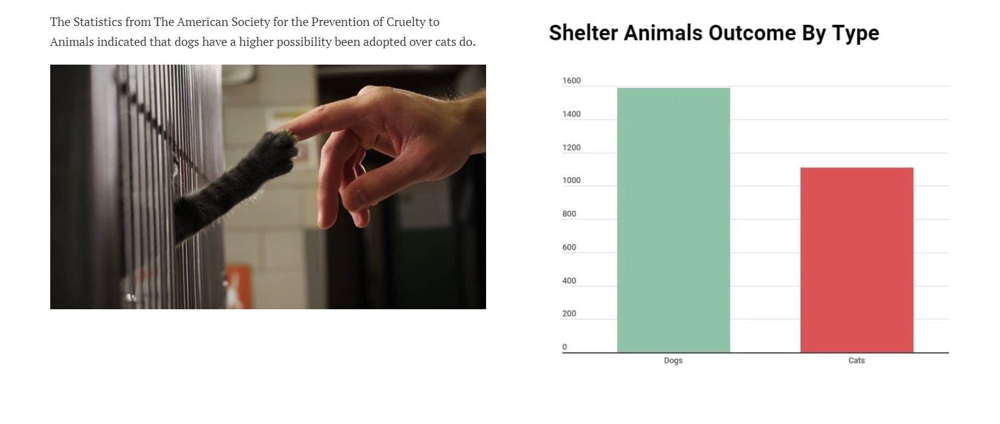

**Wireframes and Storyboards:**
I created a draft wireframe with Shorthand which contains the major components of my project. 
1. Visuals of shelter animals to introduce my topic ( 2 photos ) 

  

 
2. Overview of the shelter animals outcomes: 
a. dogs VS cats 
b. Adoption Outcomes 
c. Suboutcomes of transfer and enthuasia 
d. Pet story  
e. Shelter animal age upon adoption  

  

  

  

  

