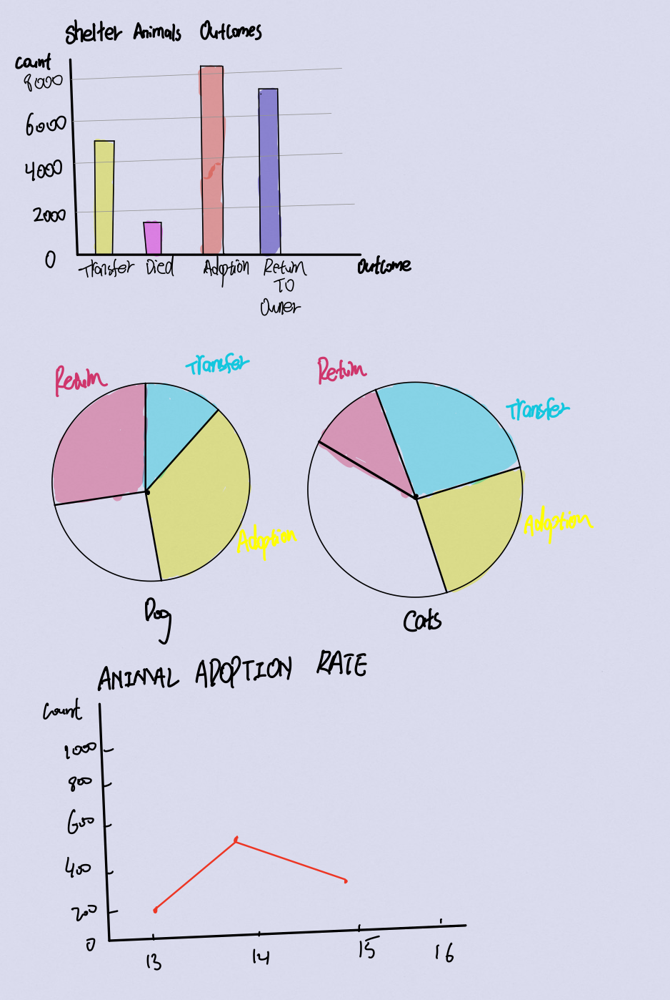

<h4 class="h3">Outline</h4> 
For my final project, I'd like to use shorthand to deliver a website to present the results of animals left the shelters to encourage people to adopt animals instead of buying animals. 
I chose this topic because as a pet owner myself, I have gotten to know some shelter animals' living conditions as well as shelter animals. I wish to use this website to acknowledge people who wish to own a pet about the current situation that shelter animals are facing. 
Some major elements my project will include are:  
1. Shelter Animals Outcomes after adoptions  
2. Important Factors to A Successful Adoption  
3. Emphasis of "Compassion over Fashion" and "Adopting over Purchasing" Visulizations. 
The story arc is to gradually introduce the audience the current situation that shelter animals are facing and what they might expect in midst of global pandemic.   
The final Call to Action is to spread the awareness of adopting over purchasing as well as compassion over fashion to encourage people who wish to adopt animals to consider the option of adopting over purchasing and while choosing an animal to adopt, Not consider it's looking first because the purpose of a pet is companion. 
<h4 class="h3">Sketches</h4> 

  

  

  

<h4 class="h3">Data Documentation</h4> 
I acquired this dataset from kaggle and plan to plot some exploraory charts with this dataset. There are eight variables in this dataset:  
ID, Name, DateTime, AnimalType, SexuponOutcome, AgeuponOutcome, Breed, Color  
I chose this dataset because there are many valueable information here. For instance I can explore how does breed affect shelter animal outcomes, and how does age affect shelter animal outcomes. These graphics would reveal some correlations between certain factors and shelter animal outcomes. By revealing these information to the audience, they might consider more comprehensively while adopting a shelter animal. 
Here is the link to the dataset:
<a href="./data/train.csv">download</a>  
<h4 class="h3">Method and Medium</h4> 
I will use shorthand to create a story including some graphcis as well as some photos from news. I envision this shorthand website will include three sections.  
Section 1: A title page showing pictures of some shelter animals with a big heading "Compassion Over Passion" --- A subtitle page gives some statistics about shelter animals such as the growth of the count of shelter animals. 
Section 3: Graphics presenting their outcomes, factors affecting the outcomes. For instance: 40% of the shelter animals ended up being transferred to another owner or shelter. Age contributes significantly to the final outcome of the animal. Dogs have a higher chance to be adopted over cats. 
After introducing these statistics and visulizations to the audience, I wish to include some current policies protecting and helping shelter animals and places where shelter animals still need help on. 
Lastly, I will include a few ways where people can seek more related resources from, ways to help initiating more policies to help shelter animals or just to spread the awareness of "Aopting over Purchasing". 
